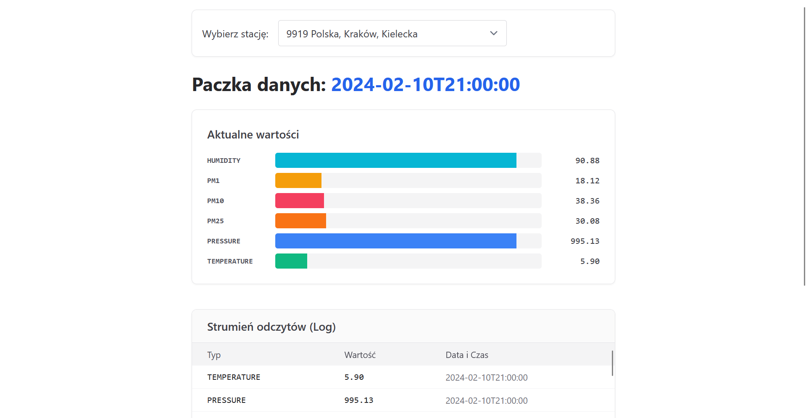

# System-Monitorowania-Powietrza

Projekt z przedmiotu **Programowanie w językach Erlang i Elixir** na Wydziale Informatyki AGH w Krakowie.

## Opis

Przetwarzanie symulowanych danych z czujników powietrza z użyciem jezyków: Erlang, Elixir
- wykorzystanie Erlanga do aplikacji typu GenServer.
- wykorzystanie Elixira do przetwarzania danych, utworzenia bazy danych i zbudowania aplikacji webowej (z użyciem frameworka Phoenix)

## Technologie

- Erlang
- Elixir, framework Phoenix
- Livebook

## Aplikacja webowa
Aplikacja wyświetlająca symulowane dane w postaci wykresów z możliwością wybrania konkretnej stacji pomiarowej

